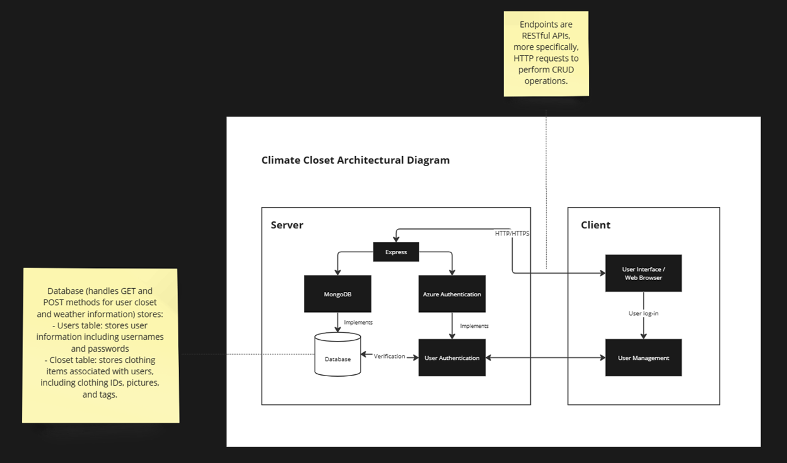

# Climate-Closet

## Project Description:

In the city of Seattle, weather can be unpredictable and there is a shared struggle among non-natives and tourists on understanding what to wear in the face of Seattle’s everchanging climate. For those who are not accustomed to Seattle’s weather, it can be a real pain to enjoy every aspect of the city. Will it rain? Is it windy? What will be the temperature at 5 PM and what should I wear? These questions can be answered with our solution, an intuitive weather application tailored to a user by using real-time data and user-friendly features to cope with Seattle’s weather patterns.

Non-natives and tourists seek to use our application primarily due to the challenges of wearing the correct clothing in the varying weather conditions of Seattle. People who are not used to living in Seattle find it annoying to decide on what to wear because of how variable the weather can be throughout the day. Weather forecasting isn’t always the most user-friendly. Wind speed, for example, is not something that people usually understand in terms of how that might affect their experience outside. Likewise, the data points often used in weather forecasting are not comprehensive enough. Rain percentages, for example, are often confused with how likely the user would experience rain when in reality it describes how much of the area would experience rain. Simplifying the experience of reading the weather and providing users with a seamless wardrobe selection would improve people's overall experience in Seattle.

After conducting research on existing solutions, there are a number of applications that provide assistance into deciding on what to wear given a location and the weather associated. For example, “What To Wear Today” and “What 2 Wear”.  

Kyle: I am interested in building out this application for the experience of using API endpoints to interact with real-time data and the storage of user-related data with MongoDB. As a Seattle native, I find it important to check the weather before heading out the door, but I don’t always make the right clothing decisions.

Lianna: As someone who is not native to Seattle, I always found it difficult to understand the complexity of the weather here (like taking into account how the wind, rain, highs, and lows can affect your experience outside). As a developer, this would be an easy way to accomplish an experience that I personally have, while also applying it in ways that we have seen similarly in class. 

## Architectural Diagram Mapping:

## Summary Tables for User Stories:

Priority	User	Description	Technical Implementation
P0	As a user	I want to be able to make an account and log in and out of the application	Use Azure Authentication
P0	As a user	I want to be able to view my online closet	Retrieve all clothing data in the database contained within the user’s userID
P0	As a user	I want to be able to add clothing items into my online closet	create new data entries and submit them to MongoDB
P0	As a user	I want to be able to edit/delete clothing items from my online closet	retrieve data for a clothing item using the clothingID and editing it or deleting its entry from MongoDB
P0	As a user	I want to view today’s weather	fetch the API from weather.com and display aspects such as current temp, highs, lows, wind speed, etc.
P0	As a user	I want to see what clothing items would suit the current weather	with the weather data fetched create internal tags (ex. If temp falls between 50-60 degrees temp=cool) then pull all clothing items from the user’s closet data that also have the corresponding tags
P1	As a user	I want to see a recommended outfit based on the weather	same as above ^ but display only one item from each clothing category (ex. shirt, pants, shoes, jacket, etc). Probably randomize in the case of multiple options. 
P1	As a user	I want an easy way to interpret the data from today’s weather	Create tags based on weather data (ex. If Wind speed < 8 mph then tag=slight breeze)
P2	As a user	I want to learn about the weather in areas outside of Seattle	alter weather.com’s Seattle URL query to instead use the zip code imputed by the user

## Endpoints:

GET /user/login

Allows users to log into their accounts. Closets are saved under each person’s account

POST /user/register

Allows users to create a new account

GET user/closet/view

Full view of clothing items currently saved on the database

GET user/closet/{clothingID}

View specific clothing items

POST user/closet/{clothingID}/edit

Update or delete tags associated with a specific clothing item

POST user/closet/add

Allows users to add clothing items to their online closet

GET /weather/view

Fetch API from weather.com to get weather statistics like current temp, wind speed, rain percentage, etc. saved into tags

GET user/outfit

Fetchs clothing items with tags correlating to the weather to suggest an outfit

## Database Schema:
Users:
•	Username (String)
•	Password (String)
Closet:
•	ClothingID (Number)
•	ClothingPic (File? Picture?)
•	ClothingTags (array of Strings)

### Citation:
[Apps to decide what to wear today](https://freeappsforme.com/apps-to-decide-what-to-wear-today/)

